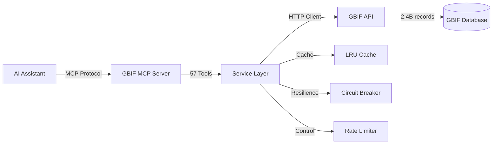

# GBIF MCP Server

**Comprehensive Model Context Protocol server for GBIF biodiversity data**

[](https://github.com/yourusername/gbif-mcp)
[](https://github.com/yourusername/gbif-mcp)
[](https://github.com/yourusername/gbif-mcp)
[](LICENSE)

## What is GBIF MCP Server?

The GBIF MCP Server provides AI assistants with comprehensive programmatic access to the [Global Biodiversity Information Facility (GBIF)](https://www.gbif.org) - the world's largest biodiversity database with over 2 billion occurrence records.

**57 MCP tools** enable AI assistants to:

- 🔍 Search and identify species across 1.9M taxa
- 📊 Query 2.4B+ occurrence records with spatial/temporal filters
- 📚 Discover 100,000+ datasets and institutional metadata
- 🗺️ Generate occurrence visualization maps
- 📖 Track 10,000+ scientific publications citing GBIF
- ✅ Validate biodiversity data against standards
- 📈 Analyze statistics and trends

## Key Features

### Comprehensive Coverage

**7 Major Categories:**
- **Species** (14 tools) - Taxonomy, identification, name parsing
- **Occurrence** (14 tools) - Observations, specimens, complete statistics
- **Registry** (17 tools) - Datasets, organizations, GRSciColl
- **Maps** (4 tools) - Tile generation, visualization
- **Literature** (2 tools) - Research impact tracking
- **Vocabularies** (3 tools) - Data standards
- **Validator** (3 tools) - Quality assurance

### Production Quality

- ✅ **246 tests** (100% passing, 74.61% coverage)
- ✅ **Circuit breaker** pattern for reliability
- ✅ **LRU caching** for performance
- ✅ **Rate limiting** and retry logic
- ✅ **Comprehensive error handling**
- ✅ **Modern TypeScript** with strict mode

### Developer Friendly

- 📝 Comprehensive parameter descriptions
- 🎯 Real-world usage examples
- 🧪 Well-tested (246 tests)
- 🏗️ Clean architecture
- 📚 Complete documentation

## Quick Example

```json
{
  "tool": "gbif_occurrence_search",
  "arguments": {
    "taxonKey": 5231190,
    "country": "KE",
    "year": "2020,2024",
    "hasCoordinate": true,
    "limit": 10
  }
}
```

**Result:** Lion occurrences in Kenya from 2020-2024 with coordinates

## Statistics

- 🌍 **2.4 billion** occurrence records
- 🦋 **1.9 million** species in taxonomy
- 📊 **100,000+** datasets
- 🏛️ **2,000+** data-publishing organizations
- 🔬 **10,000+** scientific publications tracked
- 🗺️ **Global** geographic coverage

## Get Started

Choose your installation method:

=== "NPM"
    ```bash
    npm install -g gbif-mcp
    ```

=== "Docker"
    ```bash
    docker pull gbif-mcp:latest
    docker run -i gbif-mcp
    ```

=== "From Source"
    ```bash
    git clone https://github.com/yourusername/gbif-mcp.git
    cd gbif-mcp
    npm install
    npm run build
    npm start
    ```

[Get Started →](getting-started/installation.md){ .md-button .md-button--primary }
[View Tools →](user-guide/overview.md){ .md-button }

## Architecture



## Use Cases

### Research & Analysis
- Species distribution modeling
- Biodiversity trend analysis
- Geographic range studies
- Temporal occurrence patterns

### Data Management
- Dataset discovery and selection
- Quality validation before publishing
- Name standardization and cleaning
- Metadata extraction

### Visualization
- Interactive occurrence maps
- Temporal trend charts
- Geographic distribution heatmaps
- Taxonomic breakdown graphs

### Institutional Discovery
- Find natural history collections
- Locate specimen repositories
- Discover research institutions
- Track data contributions

## Next Steps

1. [Install the server](getting-started/installation.md)
2. [Configure for your environment](getting-started/configuration.md)
3. [Try basic queries](getting-started/quick-start.md)
4. [Explore all 57 tools](user-guide/overview.md)
5. [See advanced examples](examples/basic-queries.md)

## Support

- 📖 [Documentation](https://yoursite.com/docs)
- 💬 [GitHub Issues](https://github.com/yourusername/gbif-mcp/issues)
- 🌐 [GBIF Portal](https://www.gbif.org)
- 📧 [GBIF Support](https://www.gbif.org/contact-us)

## License

Creative Commons Attribution 4.0 International License (CC-BY-4.0)

---

*Comprehensive biodiversity data access through AI-powered tools*
